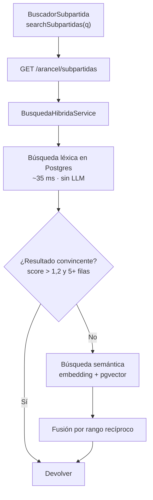
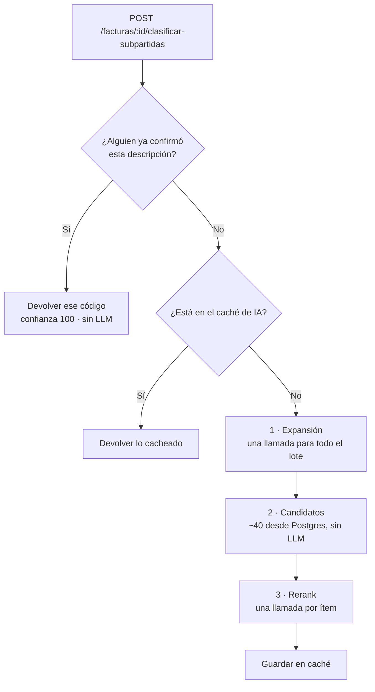

# Búsqueda y clasificación arancelaria

Cómo se resuelve, de punta a punta, el código arancelario de un producto: qué
consume el frontend, qué pasa del otro lado y qué comportamientos conviene
conocer antes de tocar la UI.

El documento está escrito desde el frontend, pero incluye el detalle del backend
necesario para entender por qué la API se comporta como se comporta.

---

## 1. Flujos

| | Búsqueda manual | Clasificación automática |
| --- | --- | --- |
| Quién la dispara | La persona, escribiendo | El sistema, al procesar una factura |
| Endpoint | `GET /arancel/subpartidas?q=` | `POST /facturas/:id/clasificar-subpartidas` |
| Usa el LLM | No | Sí |
| Latencia | ~150 ms | ~2 s por ítem |
| Devuelve | Una lista para elegir | Un código por ítem, con su fundamento |

La búsqueda manual **no llama al modelo**: es Postgres puro. Eso importa porque
es gratis, es rápida y no depende de la cuota de la API. La clasificación sí lo
llama, y ahí aparecen los límites de cuota descritos en la sección 8.

---

## 2. Lo que consume el frontend

Todo pasa por `lib/services/arancel.ts` y `lib/services/facturas.ts`, sobre el
cliente HTTP de `lib/api/client.ts` (base configurable con
`NEXT_PUBLIC_API_URL`, por defecto `http://localhost:3001/api`).

```ts
// lib/services/arancel.ts
searchSubpartidas(q, linea?)   // GET  /arancel/subpartidas?q=...
getSubpartida(code)            // GET  /arancel/subpartidas/:code
listLineas()                   // GET  /arancel/lineas

// lib/services/facturas.ts
clasificarSubpartidas(id)      // POST /facturas/:id/clasificar-subpartidas
updateFacturaItem(id, itemId, patch)  // PUT /facturas/:id/items/:itemId
```

El detalle de qué pantalla llama a qué, y bajo qué condiciones, está en la
sección 3.

### Tipos

Definidos en `lib/types/dims.ts`:

```ts
interface SubpartidaSearchResult {
  query: string
  resultados: SubpartidaMatch[]
}

interface SubpartidaMatch extends Subpartida {
  score?: number          // 0–1, normalizado contra el mejor de la tanda
  bestMatch?: boolean     // true en el primero; la UI lo marca "Sugerido"
  origenSemantico?: boolean
}
```

---

## 3. Dónde se usa cada flujo

### Mapa por pantalla

| Pantalla | Ruta | Qué usa | Cuándo se dispara |
| --- | --- | --- | --- |
| Cargar factura | `/factura` | Clasificación automática | Sola, al terminar la extracción |
| Editar factura | `/editar` | Clasificación + búsqueda manual + guardado | Diálogo de sugerencia · autoguardado |
| DIMS | `/dims` | Búsqueda manual + confirmación | Botón por fila de producto |
| DIMS (servidor) | `/dims` | Consulta por código | En el render, para calcular el GA |
| Validar / Exportar | `/validar`, `/exportar` | Nada | Trabajan sobre lo ya asignado |

---

### `/factura` — carga de documentos

`app/(app)/factura/_flow.tsx`, función `procesar()`. **Es el único lugar donde
la clasificación con IA corre sin que nadie la pida.**

```
uploadFactura(archivos)
  ↓  polling de getFactura mientras estado === "procesando"
  ↓  (hasta 20 intentos cada 800 ms ≈ 16 s)
  ↓  si estado === "error" → aborta y vuelve al paso de carga
clasificarSubpartidas(result.id)      ← acá
  ↓
step "review"
```

Condiciones:

- Solo si la extracción terminó bien. Con `estado === "error"` no se clasifica.
- Se clasifica **la factura entera** de una sola vez.
- Durante la llamada la UI está en `phase: "classifying"`.

> Esta es la pantalla donde más se nota el límite de cuota (sección 8). Con
> facturas de muchas líneas la llamada puede tardar minutos, y hoy el stepper no
> muestra progreso por ítem: pasa de "Procesar" a "Revisar" sin detalle
> intermedio.

---

### `/editar` — revisión de la factura

`app/(app)/editar/_view.tsx`. Concentra tres usos distintos.

**a) Reclasificar bajo demanda** — `SuggestionsList.handleClasificar`

- Se llega abriendo el diálogo *"Subpartida sugerida por la IA"*, con el botón
  de la fila (`setSugFor(it.id)`).
- Requiere `facturaId`; si no hay, el botón no hace nada.
- Llama a `clasificarSubpartidas(facturaId)`, que procesa **toda la factura**,
  no solo ese ítem. En la práctica solo resuelve los pendientes: el backend
  saltea los ya clasificados salvo que se fuerce.

**b) Búsqueda manual** — `handleManualSearch`

- Dentro del mismo diálogo, con su propio input.
- Solo con consulta no vacía; se dispara a mano, nunca sola.
- Muestra los primeros 4 resultados (`resultados.slice(0, 4)`).

**c) Guardado de los ítems** — `persist()`

- Recorre los ítems y llama a `updateFacturaItem` por cada uno, incluyendo
  `subpartida`, **sin** `subpartidaConfirmada` (ver sección 6).
- Los ítems agregados a mano llevan el prefijo `_new_` y se crean con
  `createFacturaItem` en vez de PUT, porque todavía no existen en el backend.
- `applySuggestion` solo cambia el estado local: el código elegido se persiste
  en el guardado siguiente.

---

### `/dims` — declaración

Esta pantalla usa el flujo en dos lugares, uno en cliente y otro en servidor.

**a) Buscador por producto** — `BuscadorSubpartida` en `_view.tsx`

- Se abre con el botón de la fila, que funciona como toggle
  (`setAbierto(a => a === item.id ? null : item.id)`). El buscador se abre **en
  la misma pantalla**: mandar a la persona a editar la factura era sacarla de la
  declaración justo donde se le estaba señalando el problema.
- **Al montarse busca sola** con la descripción del producto, sin esperar que
  se escriba nada. El estado inicial ya es "cargando", así que no hay un momento
  vacío antes del primer resultado.
- Se puede reescribir la consulta y reintentar con Enter o con el botón.
- Si hay productos sin código, aparece un aviso arriba de la tabla
  (`sinClasificar > 0`).
- Al elegir un código: `asignarSubpartida` → `updateFacturaItem` **con
  `subpartidaConfirmada: true`**. Es la única llamada del frontend que manda esa
  marca.
- `puedeGuardar={Boolean(facturaId)}`: sin factura de origen el código se
  aplica en pantalla pero no se guarda, y se avisa.
- Si el PUT falla, la fila vuelve a su estado anterior — si no, quedaría
  mostrando un código que el servidor nunca aceptó.

**b) Tasas para el cálculo del GA** — `buildGaByCode` en `page.tsx`

- Componente de servidor, en el render.
- Llama a `getSubpartida(code)` una vez por **código distinto** de la DIMS, en
  paralelo, para obtener la tasa de gravamen.
- Si una consulta falla, esa tasa queda en `0` en lugar de romper la página.

> Son N llamadas HTTP en paralelo, una por código único. Con ~150 ms cada una y
> paralelismo real el impacto es acotado, pero es el lugar donde más consultas
> por código se hacen de una vez.

---

## 4. Qué pasa cuando se busca



### La parte léxica

Una función SQL (`buscador_arancelario.buscar_subpartidas`) combina tres
accesos y los puntúa:

1. **Full-text search en español, sin acentos.** `artículo` y `articulo` son lo
   mismo; `máquinas` encuentra `maquina`.
2. **Trigramas**, para tolerar errores de tipeo.
3. **Prefijo de código**, si la consulta contiene un token de 4 o más dígitos
   (`8471`, `8471.60`). Un modelo como `M90` o una medida como `195/65` **no**
   cuentan como código.

El puntaje pondera dónde apareció la coincidencia: el texto legal de la
subpartida pesa más que la glosa heredada del capítulo, y se premia la
fracción de términos de la consulta que aparecen, para que una palabra rara y
aislada no arrastre el ranking.

### Sinónimos

Una tabla en la base traduce vocabulario comercial al del arancel **antes** de
buscar. Es necesaria porque muchos términos corrientes sencillamente no existen
en el texto legal:

| Se escribe | El arancel dice |
| --- | --- |
| `mouse`, `ratón` | dispositivo por coordenadas x-y |
| `laptop`, `notebook` | máquina automática para tratamiento de datos, portátil |
| `polera`, `remera` | camisetas de punto |
| `chompa` | suéteres, pulóveres, cárdigan |
| `calamina` | chapas onduladas de acero galvanizado |
| `garrafa` | recipiente para gas licuado |

Sin esta traducción, `mouse usb` devolvía **cero resultados**. Se editan por SQL
en `buscador_arancelario.sinonimos`; no hay pantalla de administración todavía.

### La parte semántica

Cuando lo léxico no encuentra nada convincente, se embebe la consulta y se
buscan vecinos por similitud en pgvector. Cubre lo que ningún sinónimo
anticipó.

> **Hoy está desactivada.** Se activa sola cuando el índice cubra el 98 % del
> arancel; va por el 11 %. Un índice a medio poblar es peor que ninguno: siempre
> devuelve el vecino más cercano, así que respondería con total seguridad la
> mejor opción de un subconjunto arbitrario. El fallo sería silencioso.

---

## 5. Cómo clasifica la IA

`clasificarSubpartidas(facturaId)` resuelve todos los ítems pendientes. Antes de
gastar una llamada al modelo consulta dos niveles:



**Paso 1 — expansión.** Traduce la descripción comercial al vocabulario del
arancel: `MOUSE OPT USB LOGITECH M90` → *ratón, dispositivo por coordenadas
x-y, periférico de entrada*. Es el paso que más recall aporta, porque las
facturas usan abreviaturas y el arancel lenguaje legal.

Cuando el texto no alcanza para decidir, la expansión **no inventa**: una camisa
de algodón sin más datos se expande como *"de tejido de punto o de tejido plano
(el documento no lo aclara)"*, y deja que el paso 3 decida con ambos capítulos
a la vista. Elegir al azar mandaría la búsqueda al capítulo equivocado.

**Paso 2 — candidatos.** Postgres arma ~40 opciones, garantizando variedad de
capítulos e incluyendo las subpartidas hermanas. Si todas salieran del mismo
capítulo, el modelo heredaría el error del motor léxico sin poder corregirlo.

**Paso 3 — rerank.** Una llamada elige entre esos candidatos, con las notas
legales de los capítulos involucrados y los códigos que este importador ya
confirmó antes en esos capítulos.

### Guardarraíl

**El código devuelto tiene que estar entre los candidatos.** Los modelos
alucinan códigos arancelarios con formato perfecto, y eso no se detecta a ojo.
Si no está en la lista, se descarta y el ítem queda sin clasificar.

El modelo también puede devolver `null` con `datosFaltantes` cuando la
descripción no alcanza. Es el comportamiento buscado: `ART. VARIOS` devuelve
`null` y pide naturaleza, función y materiales. **Un null honesto vale más que
un código dudoso**, porque esto termina en una declaración jurada.

---

## 6. Cómo aprende el sistema

Cuando alguien elige un código a mano, se guarda. La próxima vez que aparezca la
misma mercancía se resuelve sin llamar al modelo, y además sirve de ejemplo en
el prompt de productos parecidos.

El hash ignora orden y mayúsculas, así que `Mouse USB` y `USB mouse` son la
misma entrada.

### Esto le toca al frontend

Solo cuenta como confirmación una **decisión explícita**:

```ts
// Al elegir un código en el buscador — se aprende
updateFacturaItem(facturaId, itemId, {
  subpartida: codigo,
  subpartidaConfirmada: true,
})

// Autoguardado — NO debe llevar la marca
updateFacturaItem(facturaId, itemId, {
  descripcion, cantidad, unidad, precioUnit, subpartida,
})
```

El autoguardado reenvía la subpartida de **todos** los ítems en cada save. Si
eso contara como confirmación, cada sugerencia de la IA que nadie revisó se
guardaría como verdad y volvería como ejemplo en el prompt, reforzándose sola.

Como red de seguridad, el backend también aprende cuando el código **cambia**
respecto del guardado, aunque no venga la marca — corregir una sugerencia es una
decisión humana. Reenviar el mismo valor nunca cuenta.

Hoy la marca la manda solo `app/(app)/dims/_view.tsx`, en `asignarSubpartida`.
La pantalla de edición queda cubierta por la red de seguridad, porque el
autoguardado que lleva el código recién elegido difiere del guardado.

> Si agregás un flujo nuevo donde la persona elige un código, mandá
> `subpartidaConfirmada: true` en vez de confiar en la detección de cambio: es
> explícito y no depende de que el valor anterior fuera distinto.

---

## 7. Comportamientos que sorprenden

**`linea` siempre llega `null`.** Era metadata del seed de demo
(blanca/negra/electrónica); el Arancel 2026 no tiene un campo equivalente. El
parámetro `?linea=` se acepta por compatibilidad pero ya no filtra. El endpoint
`/arancel/lineas` sigue existiendo como metadata de UI.

**`ice` siempre llega `0`.** El ICE del arancel no es un porcentaje único: son
seis columnas por régimen (cigarros, bebidas, vehículos por año). Modelarlo bien
es trabajo aparte.

**`desc` es compuesta, no el texto legal.** El texto propio de una subpartida
suele ser residual —`- - - Los demás`— e inservible aislado. El backend arma
`desc` con el encabezado de partida (que nombra la mercancía) más el tramo final
(que la distingue de sus hermanas). La ruta jerárquica completa viene en `ruta`,
útil para un tooltip o una segunda línea.

**Los códigos llevan puntos.** La API devuelve `8471.60.20.00`. Para buscar por
código se acepta cualquier formato: `8471.60.20.00`, `8471602000` o con
espacios; el backend normaliza a dígitos.

**Solo se devuelven códigos declarables.** Los 8.132 de 10 dígitos. Las
subpartidas intermedias de 6 u 8 dígitos no aparecen nunca, porque declarar una
en una DIMS la haría rechazar.

---

## 8. Números medidos

Sobre 16 consultas de prueba con el código correcto conocido:

| | |
| --- | --- |
| El correcto en el primer puesto | 10/16 |
| En los primeros 5 | 15/16 |
| En los primeros 40 | 16/16 |

Latencia de búsqueda: **~35 ms** de consulta en el servidor, **~150 ms** de
extremo a extremo. La diferencia es casi toda latencia de red hasta Aiven; desde
un backend desplegado en la misma región debería bajar bastante.

Clasificación: entre 3.000 y 10.000 tokens de entrada por ítem, más una llamada
de expansión por lote. Alrededor de 2 s por ítem, con 3 ítems en paralelo
(`LLM_CONCURRENCIA`).

> **Cuidado con el plan gratuito de Gemini: 20 solicitudes por minuto.**
> Clasificar una factura son `1 + N` llamadas, así que una de más de ~19 líneas
> toca el límite. El backend reintenta con espera, pero la operación se alarga
> bastante. La UI debería tolerar que `clasificarSubpartidas` tarde minutos en
> facturas largas.

---

## 9. Dónde vive cada cosa

| | |
| --- | --- |
| Base del arancel | `aranceles` (Aiven), esquema `buscador_arancelario` |
| Base de la app | `dimsai` (Aiven) — facturas, DIMS, caché, aprendidas |
| Datos de búsqueda | Vista materializada `arancel_busqueda`, 8.132 filas |
| Notas legales | Tabla `Notas Tecnicas`, 98 capítulos |
| Migraciones | `DIMS-AI/db/migrations/*.sql`, numeradas y reaplicables |

Son dos bases distintas de la misma instancia, así que el backend mantiene dos
conexiones: Postgres no permite consultar entre bases.

Tras recargar el arancel de un año nuevo hay que refrescar la vista:

```sql
SELECT buscador_arancelario.refrescar_arancel_busqueda();
```

Y regenerar los embeddings de lo que haya cambiado:

```bash
npm run embeddings:backfill   # en el proyecto DIMS-AI
```

---

## 10. Pendientes conocidos

- **Embeddings al 11 %** (900 de 8.132). La búsqueda semántica está desactivada
  hasta el 98 %.
- **Sin ABM** para sinónimos ni para revisar clasificaciones aprendidas
  equivocadas. Hoy se corrigen por SQL.
- **Ranking flojo con consultas largas.** Agregar `manga larga` a
  `camisas de algodón para hombre` empeora el resultado: esos términos matchean
  pantalones largos. Conviene sugerir consultas cortas y específicas.
- **`ice` sin modelar** (ver sección 7).
